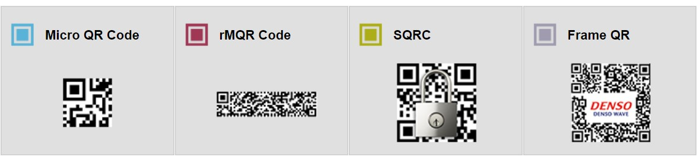
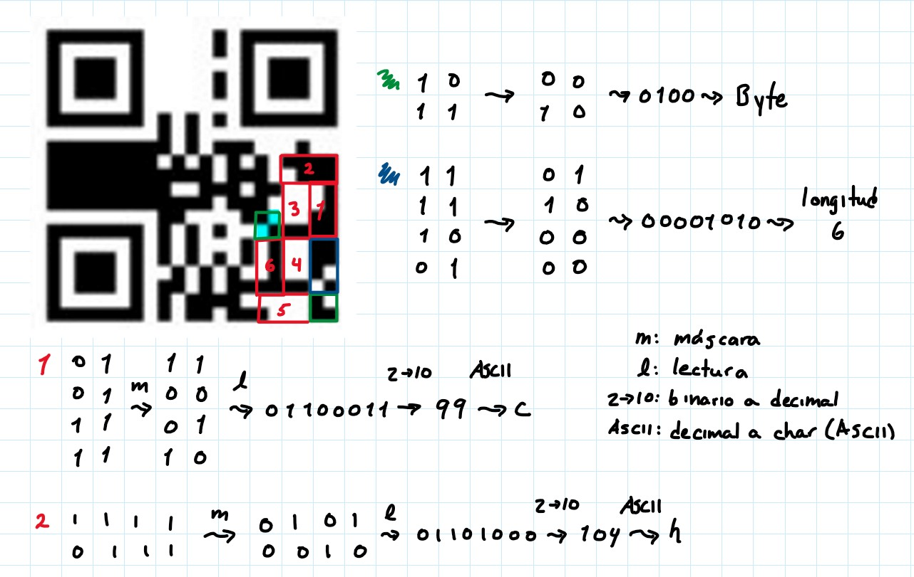
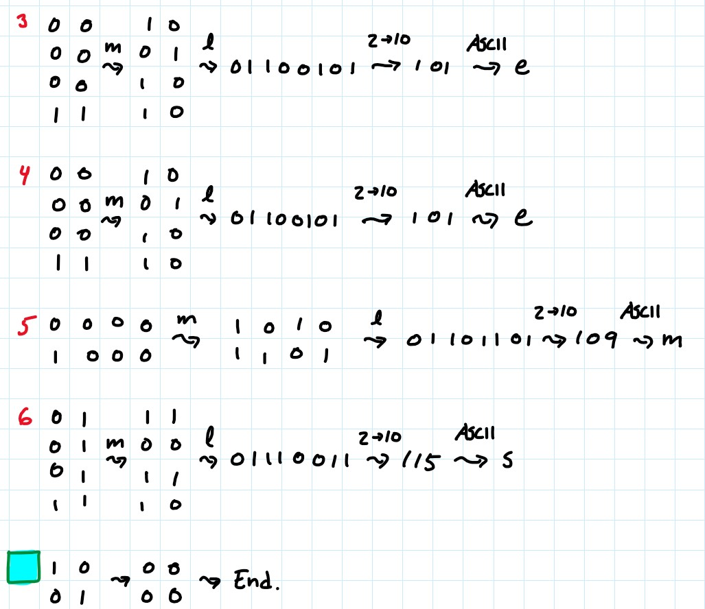

# Práctica 3: Códigos QR
## *Equipo: Avonlea*
### Integrante~~s~~: Sergio Medina Guzmán 314332428

## Para ejecutar los requisitos de la práctica:

### Introducción:
Primero que nada una disculpa por repetir el lenguaje jiji, este semestre programé principalmente en Python
y el nivel de confianza y seguridad que tengo con este lenguaje (y la poca disponibilidad de tiempo que tengo
en fin de semestre), hicieron que prefiriera este lenguaje nuevamente por encima de Java, lenguaje con el cual
no me siento del todo cómodo aún, jeje, aunque habría estado bien aventarme e intentarlo... digo, eventualmente
sé que programaré en Java (o, bueno, tal vez no, al futuro uno nunca le sabe...), pero, bueno...

### Desarrollo:
### Conclusiones:
# Preguntas:
1. Antes de empezar la práctica, ¿cómo crees que funcionaban los códigos QR?
Ya pensaba que había cuadrados blancos y negros, y que la forma en que se distribuían en el
código era la información que contenían, pero pensaba que, salvo los cuadros de posición, eran
únicamente la forma de decir a los lectores de códigos QR "ah, esto es un QR", digamos, como si
fuera el equivalente a una extensión de archivo. No tenía idea que el código se dividía en
regiones y que cada una de estas tenían su propio funcionamiento; mucho menos me imaginaba que
existía un código de corrección de errores y bits redundantes en los códigos.
2. Lista al menos 10 lugares diferentes donde hayas visto códigos QR, ya sea digital o en físico.
   1. En Whatsapp, para iniciar sesión en la computadora.
   2. En Telegram, mismo fin que en Whatsapp.
   3. En restaurantes, durante la pandemia, para descargar el menú virtual por la desaparición temporal
   de los menús físicos.
   4. En la Nintendo Switch, para transferir imágenes o videos tomados en la consola durante
   el gameplay a un teléfono; hay un código que hace que el celular se conecte a la red de la
   consola y otro código para acceder a una página web donde se descargan los archivos al teléfono.
   5. En una máquina InBody, las tienen en el gimnasio al que voy, es una máquina que toma
   datos biométricos, como IMC, porcentaje de masa/grasa muscular, etc; el QR se usa para enlazar
   tu aplicación en el teléfono con el sistema de InBody para que a partir de ese momento cada
   medición con la máquina envíe automáticamente tus datos biométricos a tu aplicación.
   6. En Whatsapp, las cuentas de Whatsapp Business pueden generar un QR para que, al escanearlo
   se abra en tu teléfono un chat en la aplicación con dicha cuenta.
   7. Al momento de hacer un pago con QoDi, se lee desde la aplicación de tu banco el QR del establecimiento
   que te está haciendo un cobro, se abre entonces una serie de pantallas (o Actividades, si estamos en
   Android), que te guían para hacer tu pago desde tu celular, sin contacto, sin tarjetas y sin PIN en una
   terminal bancaria. (Este anuncio de QoDi no fue patrocinado por nadie, jeje)
   8. Mi botella de protector solar tiene un código QR, te manda a una página web de la empresa con la
   información del producto.
   9. La caja de un control de Nintendo Switch tiene un código QR, te manda a una página de Nintendo; supongo
   que es para soporte técnico, pero el control lo pedí de Japón, así que me manda a la página de Nintendo
   Japón, y no sé japonés, por lo tanto, no estoy seguro de qué será lo que viene en la página. En la URL viene
   .../support/..., así que supongo que sí será para soporte técnico...
   10. El ticket de entrada al Palacio de Versalles tiene un código QR que te dirige a la Play Store (supongo
   que en un iPhone te dirigirá a la App Store) para descargar la aplicación del Palacio, para una visita
   con audioguías y más contenido del recinto.
   11. Como mención honorífica, encontré en la parte trasera de un libro un código similar al QR, igual en la
   parte trasera de un amiibo de Nintendo y también en mis tickets de entrada a Parc Güell y a un concierto
   en una sala de conciertos de Múnich. No he investigado hasta este punto qué tipo de códigos son; lo veré en
   la pregunta 7, correspondiente a las variantes de códigos QR.
      
3. ¿Cuál es el número máximo de caracteres que podemos almacenar en un código QR de tamaño 21x21?
Según la página de [Thonky](https://www.thonky.com/qr-code-tutorial/character-capacities), esto varía dependiendo
del tipo del nivel de corrección de errores. Para los niveles L, M, Q, H, se podrán almacenar hasta
25, 20, 16 y 10 caracteres alfanuméricos, respectivamente.

4. ¿Cuál es el número máximo de caracteres que podemos almacenar en un código QR de tamaño
177*177?
Según la página de [Thonky](https://www.thonky.com/qr-code-tutorial/character-capacities), esto varía dependiendo
del tipo del nivel de corrección de errores. Para los niveles L, M, Q, H, se podrán almacenar hasta
4296, 3391, 2420 y 1852 caracteres alfanuméricos, respectivamente.

5. ¿Por qué es posible sobreponer logos o imágenes en el código QR?
Porque podemos usar un nivel de corrección, preferentemente Q o H, que permitirá que aún puedan
ser escaneados incluso si un 25% o 30% de su superficie está cubierta o "corrupta". Podemos pensar en
las imágenes superpuestas como "ruido" y el nivel de corrección será el algoritmo que nos permita
recuperar la información del código QR a pesar de la presencia de dicho "ruido".

6. ¿Cuáles son los valores de:
   1. Nivel de corrección
   Dado que los dos cuadritos correspondientes al nivel de corrección son negros, equivalen a 11, lo cual, según
   la página [Thonky](https://www.thonky.com/qr-code-tutorial/format-version-information#the-error-correction-bits)
   equivale al nivel de corrección Q.

      2. Máscara
      Dado que los tres cuadritos correspondientes a la máscara son negro-blanco-negro, esto equivale a 101, lo cual
      es 5 en binario y según la página de [Thonky](https://www.thonky.com/qr-code-tutorial/mask-patterns), esto es
      ((row * column) mod 2) + ((row * column) mod 3) == 0.
   
   para el siguiente QR?

   

7. Menciona al menos 5 variantes (y adjunta imágen) de códigos QR.
Según la página de la compañía japonesa, DENSO WAVE, creadora de los códigos QR, tenemos las siguientes variantes
de los códigos QR:
   1. Micro QR Code
   2. rMQR Code
   3. SQRC
   4. y Frame QR
Imágenes:

El quinto tipo que menciona la web es el código QR con el que trabajamos. Ninguno de estos tipos de variantes
son los códigos que mencioné en el punto xi de la pregunta 2... queda hacer una búsqueda...
Después de una búsqueda cortita, encontré que se trata de los códigos Data Matrix, desarrollados
por la compañía ID Matriz en 1987:

8. El siguiente código QR se le ha eliminado información importante, pero sabiendo que tenía la máscara
010 (3) aplica la máscara para sacar el mensaje oculto que guarda, leyendo de la misma forma en la que
se escribe.

...

El mensaje... es... "cheems"...
Procedimiento:
- Las 4 celdas de la esquina inferior derecha indican que el encoding es de byte.
- Las siguientes 8 celdas, leyendo como se vio en laboratorio, indican la longitud del mensaje: 6.
- Los siguientes 6 bloques de 8 celdas cada uno, indicarán el valor en binario del caracter codificado: cheems
- Después de los 6 bloques de 8 celdas, hay un bloque de 4 celdas, que indica el final del mensaje.

9. Si podemos guardar cualquier tipo de informacion, podemos guardar fotografías o videos dentro de un
QR?
Sí, es posible. Sin embargo, dadas las limitaciones de almacenamiento de los códigos QR, el tamaño de las
imágenes y de los videos será lo que nos permitirá o no guardarlos. Una buena técnica de compresión podría
disminuir el tamaño de la imagen/del video y nos permitiría almacenarlos en un código QR.
10. ¿Por qué los códigos QR pueden ser peligrosos?
Porque no existe una regulación o medidas de seguridad que permitan analizar si la información almacenada
en un código QR es segura. Cualquiera puede almacenar cualquier información en un código QR y, si alguien
lo escanea, puede ser víctima de la persona que almacenó la información en dicho código QR. Existe de hecho
el término QRishing, que se refiere al pishing a través de códigos QR. La víctima escanea el código y este la
dirige a un sitio web falso donde ingresa datos sensibles, como personales o bancarios.
11. Menciona brevemente en qué son parecidos los códigos HammingCode, BarCode, AztecCode,
MatrixCode y QuickResponse y en qué son diferentes.
Los códigos Hamming, Barcode, Aztec Code, Matrix Code y Quick Response (QR) son todos métodos de codificación utilizados en diferentes contextos para almacenar y transmitir información. Aquí hay una breve descripción de sus similitudes y diferencias:
    1. Similitudes:

       - Todos son tipos de códigos de barras o códigos bidimensionales que se utilizan para almacenar datos en un formato legible por máquina.
       - Proporcionan una forma eficiente de almacenar y recuperar información mediante la representación gráfica de patrones o combinaciones de elementos.
       - Pueden ser escaneados o leídos por dispositivos específicos, como escáneres de códigos de barras o aplicaciones móviles.

    2. Diferencias:

       - Código Hamming: Es un tipo de código de corrección de errores utilizado para detectar y corregir errores en la transmisión de datos. Se utiliza principalmente en sistemas de comunicaciones y almacenamiento de datos para garantizar la integridad de la información transmitida.
       - Barcode (código de barras): Es un método de codificación que utiliza barras y espacios de diferentes anchos y patrones para representar datos alfanuméricos. Los códigos de barras se utilizan ampliamente en la industria para identificar y rastrear productos, y se pueden encontrar en artículos de consumo, etiquetas de envío, tarjetas de membresía, etc.
       - Aztec Code: Es un tipo de código bidimensional que utiliza una matriz de módulos cuadrados para almacenar información. Se utiliza en aplicaciones que requieren una alta densidad de datos, como boletos de transporte público, entradas de eventos y tarjetas de embarque.
       - Matrix Code (código de matriz): Es otro tipo de código bidimensional que utiliza una matriz de módulos cuadrados o rectangulares para almacenar información. A diferencia de otros códigos, el Matrix Code se puede leer desde cualquier dirección y permite un alto grado de redundancia para una mejor capacidad de recuperación de datos.
       - Quick Response (QR): Es un tipo de código bidimensional que utiliza una matriz de módulos cuadrados para almacenar información. Los códigos QR se utilizan ampliamente en marketing, publicidad y aplicaciones comerciales debido a su capacidad para almacenar varios tipos de datos, como texto, URL, contactos, ubicaciones y más. También tienen una mayor capacidad de almacenamiento en comparación con otros códigos bidimensionales.

12. ¿Algún día se nos acabarán las posibles combinaciones de QR? ¿Cuándo?
Vi este (video)[https://www.youtube.com/watch?v=RFLx7AGo5u8]... basándome en él, escribo lo siguiente, que es un parafraseo
de lo que menciona el chico del video:

Teóricamente, dado que tenemos un número finito de celdas en en los códigos QR, tendríamos un número
finito de posibles combinaciones. Sin embargo, consideremos que el tamaño máximo de los códigos QR es de 177x177, lo
que nos da 31,329 cuadritos, podemos eliminar los cuadros correspondientes a la máscara, al nivel de
corrección, los marcadores de posición y los que son ocupados por los patrones de alineamiento, aunque no
perderíamos muchos... bueno, el punto es que cada cuadro puede tener dos estados: blanco o negro, si tenemos
aproximadamente 31,329, tenemos entonces 231329 posibles códigos QR (aproximadamente, habría que
calcular cuántos cuadritos perdemos por el espacio que usan los elementos previamente mencionados). Este es
un número inimaginablemente grande. Ahora, en el universo se estima que hay 1080 átomos, aproximadamente;
231329 es aproximadamente. Haciendo la ecuación 231329=10x, obtenemos que
¡x es aproximadamente 9425! Esto quiere decir que existen más combinaciones posibles para códigos QR que átomos en el
universo. Creo que si incluso si retiramos los cuadritos equivalentes al espacio que no puede usarse porque está reservado,
esta cifra sigue siendo ~~grotescamente~~ impresionantemente grande. Y si retiramos esos espacios, no estamos considerando
que podríamos tener una misma secuencia de datos en la información almacenada del código QR que se interpretará de
manera distinta dependiendo de si la zona de modo de codificación (si es Kanji, alfanumérico, etc), esto incrementa
aún más nuestras posibilidades. Sí, tenemos, para los códigos QR de 177x177, aproximadamente 231329
posibles códigos, a eso hay que sumarle los posibles códigos de dimensiones menores. Esto seguirá siendo un número
finito, sí. Del hecho de que tenemos un número finito de posibles códigos QR, se deriva que eventualmente se acabarán;
sin embargo, el *cuándo*... bueno, yo creo que antes se acaba la raza humana que los códigos QR... Y si antes
se acaba la raza humana que los códigos QR, no habrá quién siga creando códigos QR (supongamos que ninguna forma
de vida inteligente, de existir, en el resto del universo nos encontrará, o que si nos encuentra, nunca podrá entender
cómo funcionaban los códigos QR (ya sea por falta de evidencia o por que se destruyó toda evidencia de su existencia)), por
lo que se sigue que nunca se nos acabarán las posibles combinaciones de QR. Bueno, el final fue muy especulativo, pero
creo que fue divertido.
Esta práctica, esta última pregunta, me deja con esa sensación extraña que sientes al enfrentarte a una inmensidad y que
te hace sentir todo extraño y diminuto en comparación con el universo... Termino Teoría de Códigos con un nuevo
trauma desbloqueado, jeje.