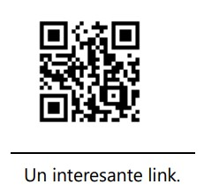
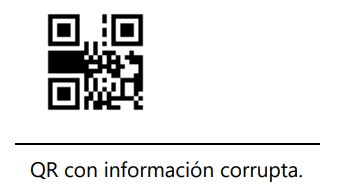

# Práctica 3: Códigos QR
## *Equipo: Avonlea*
### Integrante~~s~~: Sergio Medina Guzmán 314332428

## Para ejecutar los requisitos de la práctica:

### Introducción:
Primero que nada una disculpa por repetir el lenguaje jiji, este semestre programé principalmente en Python
y el nivel de confianza y seguridad que tengo con este lenguaje (y la poca disponibilidad de tiempo que tengo
en fin de semestre), hicieron que prefiriera este lenguaje nuevamente por encima de Java, lenguaje con el cual
no me siento del todo cómodo aún, jeje, aunque habría estado bien aventarme e intentarlo... digo, eventualmente
sé que programaré en Java (o, bueno, tal vez no, al futuro uno nunca le sabe...), pero, bueno...

### Desarrollo:
### Conclusiones:
# Preguntas:
1. Antes de empezar la práctica, ¿cómo crees que funcionaban los códigos QR?
Ya pensaba que había cuadrados blancos y negros, y que la forma en que se distribuían en el
código era la información que contenían, pero pensaba que, salvo los cuadros de posición, eran
únicamente la forma de decir a los lectores de códigos QR "ah, esto es un QR", digamos, como si
fuera el equivalente a una extensión de archivo. No tenía idea que el código se dividía en
regiones y que cada una de estas tenían su propio funcionamiento; mucho menos me imaginaba que
existía un código de corrección de errores y bits redundantes en los códigos.
2. Lista al menos 10 lugares diferentes donde hayas visto códigos QR, ya sea digital o en físico.
   1. En Whatsapp, para iniciar sesión en la computadora.
   2. En Telegram, mismo fin que en Whatsapp.
   3. En restaurantes, durante la pandemia, para descargar el menú virtual por la desaparición temporal
   de los menús físicos.
   4. En la Nintendo Switch, para transferir imágenes o videos tomados en la consola durante
   el gameplay a un teléfono; hay un código que hace que el celular se conecte a la red de la
   consola y otro código para acceder a una página web donde se descargan los archivos al teléfono.
   5. En una máquina InBody, las tienen en el gimnasio al que voy, es una máquina que toma
   datos biométricos, como IMC, porcentaje de masa/grasa muscular, etc; el QR se usa para enlazar
   tu aplicación en el teléfono con el sistema de InBody para que a partir de ese momento cada
   medición con la máquina envíe automáticamente tus datos biométricos a tu aplicación.
   6. En Whatsapp, las cuentas de Whatsapp Business pueden generar un QR para que, al escanearlo
   se abra en tu teléfono un chat en la aplicación con dicha cuenta.
   7. Al momento de hacer un pago con QoDi, se lee desde la aplicación de tu banco el QR del establecimiento
   que te está haciendo un cobro, se abre entonces una serie de pantallas (o Actividades, si estamos en
   Android), que te guían para hacer tu pago desde tu celular, sin contacto, sin tarjetas y sin PIN en una
   terminal bancaria. (Este anuncio de QoDi no fue patrocinado por nadie, jeje)
   8. Mi botella de protector solar tiene un código QR, te manda a una página web de la empresa con la
   información del producto.
   9. La caja de un control de Nintendo Switch tiene un código QR, te manda a una página de Nintendo; supongo
   que es para soporte técnico, pero el control lo pedí de Japón, así que me manda a la página de Nintendo
   Japón, y no sé japonés, por lo tanto, no estoy seguro de qué será lo que viene en la página. En la URL viene
   .../support/..., así que supongo que sí será para soporte técnico...
   10. El ticket de entrada al Palacio de Versalles tiene un código QR que te dirige a la Play Store (supongo
   que en un iPhone te dirigirá a la App Store) para descargar la aplicación del Palacio, para una visita
   con audioguías y más contenido del recinto.
   11. Como mención honorífica, encontré en la parte trasera de un libro un código similar al QR, igual en la
   parte trasera de un amiibo de Nintendo y también en mis tickets de entrada a Parc Güell y a un concierto
   en una sala de conciertos de Múnich. No he investigado hasta este punto qué tipo de códigos son; lo veré en
   la pregunta 7, correspondiente a las variantes de códigos QR.
      
3. ¿Cuál es el número máximo de caracteres que podemos almacenar en un código QR de tamaño 21x21?
Según la página de [Thonky](https://www.thonky.com/qr-code-tutorial/character-capacities), esto varía dependiendo
del tipo del nivel de corrección de errores. Para los niveles L, M, Q, H, se podrán almacenar hasta
25, 20, 16 y 10 caracteres alfanuméricos, respectivamente.

4. ¿Cuál es el número máximo de caracteres que podemos almacenar en un código QR de tamaño
177*177?
Según la página de [Thonky](https://www.thonky.com/qr-code-tutorial/character-capacities), esto varía dependiendo
del tipo del nivel de corrección de errores. Para los niveles L, M, Q, H, se podrán almacenar hasta
4296, 3391, 2420 y 1852 caracteres alfanuméricos, respectivamente.

5. ¿Por qué es posible sobreponer logos o imágenes en el código QR?
Porque podemos usar un nivel de corrección, preferentemente Q o H, que permitirá que aún puedan
ser escaneados incluso si un 25% o 30% de su superficie está cubierta o "corrupta". Podemos pensar en
las imágenes superpuestas como "ruido" y el nivel de corrección será el algoritmo que nos permita
recuperar la información del código QR a pesar de la presencia de dicho "ruido".

6. ¿Cuáles son los valores de:
   1. Nivel de corrección
   Según la página de [Thonky](https://www.thonky.com/qr-code-tutorial/format-version-information#the-error-correction-bits)
   tenemos los siguientes valores:

   |Nivel de corrección| Valor (en bits) |
   |:---:|:---:|
   |L|       01        |
   |M|       00        |
   |Q|       11        |
   |H|       10        |

   2. Máscara
   
   para el siguiente QR?

   
7. Menciona al menos 5 variantes (y adjunta imágen) de códigos QR.
8. El siguiente código QR se le ha eliminado información importante, pero sabiendo que tenía la máscara
010 (3) aplica la máscara para sacar el mensaje oculto que guarda, leyendo de la misma forma en la que
se escribe.

9. Si podemos guardar cualquier tipo de informacion, podemos guardar fotografías o videos dentro de un
QR?
10. ¿Por qué los códigos QR pueden ser peligrosos?
11. Menciona brevemente en qué son parecidos los códigos HammingCode, BarCode, AztecCode,
MatrixCode y QuickResponse y en qué son diferentes.
12. ¿Algún día se nos acabarán las posibles combinaciones de QR? ¿Cuándo?